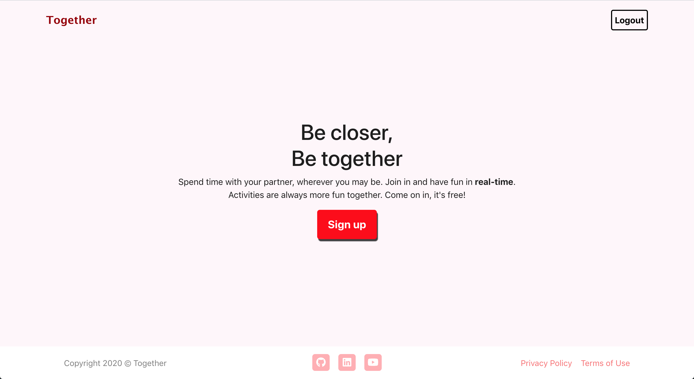

# Together
A Real-time interactive virtual space for couples.

## Note
This web app is **in development**. Designs and features are not final and are still undergoing constant implementation, testing, and changes.

## Overview
**❤️ &nbsp; Home page** (Still in development): http://localhost:3000/

Together is a website focused on giving couples a "virtual room" or space to interact and have fun together. In order to simulate closeness and intimacy as much as possible, Together provides interactions in real-time. 

Inside each room, couples will have the ability to draw on a **shared canvas**. A space to create and **share lists** (To-do, shopping, etc.) will also be avialable and updated in real-time. And finally, a **fun daily quiz** application that tests couples on vaious topics is included as well. These questions help spark interesting conversations and give more insight into the relationship. Couples will not only answer their own questions, but they will also try to guess the other's answers. Points will be awarded accordingly. Of course, a couples app is not complete with various interesting **stats about the relationship**. Hence, these stats, such as the number of days together, will be elegantly displayed beside the above features.

### Short Demos of Main Features (In Development)
Note the quality may be low due to conversion from video to GIF format.  

### Screenshots

### Architecture
Together is a single-page application (SPA) website built with React and Django. [Create React App](https://github.com/facebook/create-react-app) was used to bootstrap the frontend. Implementation of the real-time interactive components is done with websockets using JavaScript's [WebSocket API](https://developer.mozilla.org/en-US/docs/Web/API/WebSocket) in the frontend and [Django Channels](https://channels.readthedocs.io/en/latest/) in the backend.

**Frontend**
- Languages: 
 	* JavaScript
	* HTML
	* CSS
- Main Framework/Libraries:
 	* [React](https://reactjs.org/) (create-react-app)
	* [axios](https://www.npmjs.com/package/axios)
	* [Bootstrap](https://getbootstrap.com/)
	* [Font Awesome](https://fontawesome.com/)

**Backend**
- Language: 
	* Python
- Main Framework/Libraries:
 	* [Django](https://www.djangoproject.com/)
	* [Django REST framework](https://www.django-rest-framework.org/)
	* [Django Channels](https://channels.readthedocs.io/en/latest/)

**Database**
- [MySQL](https://www.mysql.com/)

## Bug Reports and Improvements
If you experience any bugs or see anything that can be improved or added, please feel free to [open an issue](https://github.com/PeterBohai/together/issues) here or simply contact me through any of the methods below. Thanks in advance!

Email: peterbohai@gmail.com  
Linkedin: https://www.linkedin.com/in/peterhu08
